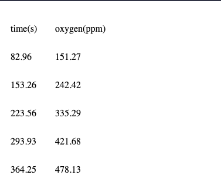

# Arduino_oxygen_sensor

I made a circuit board to detect gas oxygen and display it on the internet. This is not a liquid oxygen sensor. This could be useful for anaerobic chamber monitoring.

Parts:
```
1 conductive paint/solder "910-CP1-5S CP1-5S Conductive Paint LR"
1 2462 OpAmp
2 10 uF electrolytic capacitors
2 100 nF capacitors
1 10 ohm resistor
2 4.7k ohm resistors
3 10k ohm resistors
1 MKR wifi 1010 arduino chip
1 560 ohm resistor
1 LCD display with potentiometer resistor "1528-1502-ND LCD MOD 32DIG 16X2 TRANSMISV WHT"
1 EC410 oxygen sensor
1 outlet to USB MICRO B adapter. I used the two parts to accomplish this:
 490-SWI3-5-N-I38 SWI3-5-N-I38
 RoHS1 895-CUB-100-BK CUB-100-BK USB A To USB MICRO B

1 circuit board
```
You can buy the circuit board here:
https://oshpark.com/shared_projects/SpwukUbW

Solder all the parts in, except for the O2 sensor. For the O2 sensor I used conductive paint since the instructions say that heat can damage it.


In the Arduino IDE, I had to install the board manager for MKR Wifi 1010 by installing "Arduino SAMD boards". Make sure to change it for your network and password.

The O2 sensor is not accurate for normal air. The sensitivity is determined by the RGain resistor, so these images are just for illustrative purposes. However, this sensor can detect when it's in a functioning anaerobic chamber.

##### How does it generally work?
The EC410 needs to maintain a potential difference of 600 mV. I implemented this by smoothing the Arduino's PWM (4.7k ohm and 10 uF capacitors) and applying this smoothed signal to the + pins of the OP amp. The EC410 sensor can change a bit, and the potentials are adaptively compensated by the - pins of the OP amp. I implemented this as the schematic that I found at figure 4 of

https://www.sgxsensortech.com/content/uploads/2014/08/A1A-EC_SENSORS_AN2-Design-of-Electronics-for-EC-Sensors-V4.pdf


Once the chip is plugged in, it will display an ip address. If you visit that address you will see the chip's measurement history. I wrote the table so that it should be pretty easily queried by python's pandas.read_html() method.

